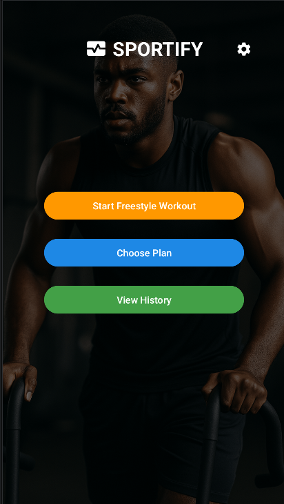

# Sportify - Personal Fitness Tracker App

**Sportify** is a lightweight Android fitness tracking app that lets you follow structured plans like Stronglifts, PHUL, and PHAT — or build your own custom routines from scratch. Stay on track, log your sets and reps, and view your history with a smooth, dark-themed UI.


## Features

### **1. Dashboard**  
Minimal UI with quick access to:
- Freestyle Workout
- Choose a Plan
- View History

### **2. Workout Plans**
- Pre-seeded: Stronglifts 5x5, PHUL, PHAT
- Build your own plans: add days, exercises, and goals

### **3. Workout Tracking**
- Timed sessions with pause/resume
- Strength entry: sets, reps, weight
- Freestyle notes
- Finish & auto-save to database

### **4. Workout Summary**
- Duration, calories, notes, breakdown
- Friendly summary screen with “Done” flow

### **5. Workout History**
- Chronological log of all workouts
- Summary cards show sets, reps, notes
- Auto-refresh on resume

### **6. Settings**
- Personal info & unit preferences
- Saved to SQLite

## Screenshots

### 1. Dashboard 
 

### 2. Plan Overview
 

### 3. Workout Summary 
 

## Tech Stack

- **Java**
- **SQLite** (local storage)
- **RecyclerView** (history)
- **CardView** (UI)
- **Handler** (timing)
- **SharedPreferences** (app settings)

## How to Run

### 1. Clone the repo:
   ```bash
   git clone https://github.com/lizardcat/sportify.git
```

### 2. Open in Android Studio

### 3. Run on device or emulator (Android 6.0+)

 **Note**: On first launch, plans are seeded via seedTestData() Data is stored locally via SQLite